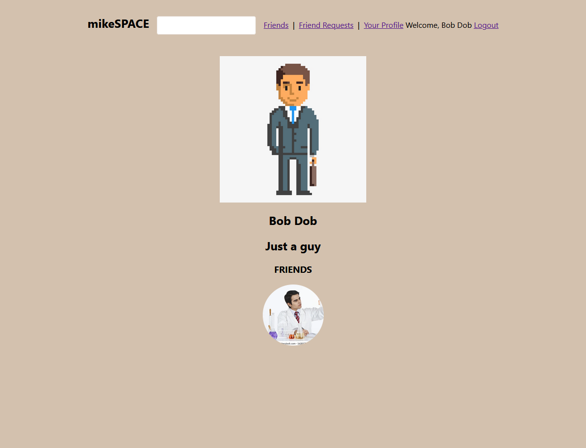
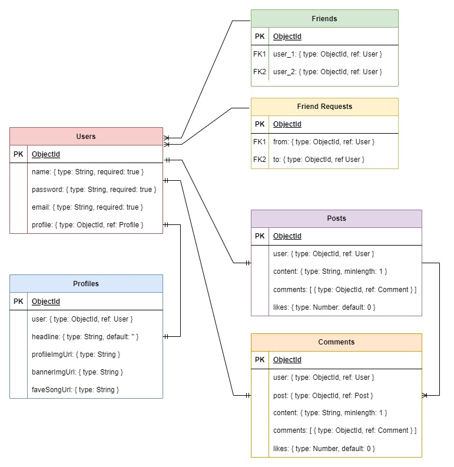

# Social Media Site - Myspace clone

## Introduction

[Live Site](https://mspace-social-media.herokuapp.com/)

This project is an early development social media site intended to be reminiscent of the days old trailblazer of social media. It will draw a sense of nostalgia from those who grew up using it, while also offering unique features that make it appealing to new users.

## Technologies Used
- React
- Express
- Mongoose/MongoDB
- NodeJS

## Getting Started

[Trello](https://trello.com/b/COgvqkCJ/progress)

[Wireframes](https://www.figma.com/file/FAQAHILI4Axbg62aYsN16g/PS-Social-Media?type=design&node-id=0%3A1&t=Y6EcYcYf8h4ArZNU-1)

## Unsolved Problems

- Need to limit amount of users being shown in different sections

## Future Enhancements
- Allow for updating user password
- Allow for updating profile information
- Add posting and commenting functionality
- Add customizable settings for profile and a settings page
- Bells and whistles (styling)

## Sources
- https://stackoverflow.com/questions/35352638/how-to-get-parameter-value-from-query-string

- https://stackoverflow.com/questions/18867628/mongoose-deep-population-populate-a-populated-field

- https://stackoverflow.com/questions/7382207/mongooses-find-method-with-or-condition-does-not-work-properly

- https://stackoverflow.com/questions/7101703/how-do-i-make-case-insensitive-queries-on-mongodb/7101938#7101938

- https://stackoverflow.com/questions/9598505/mongoose-retrieving-data-without-id-field

- https://stackoverflow.com/questions/33007878/nodejs-typeerror-require-is-not-a-function

- https://stackoverflow.com/questions/46820682/how-do-i-reload-a-page-with-react-router

- https://www.educative.io/answers/what-is-exists-in-mongoose